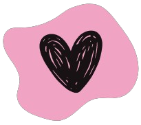

#  Nathalia Cappellini

 ⊹ Olá, sou estudante de Análise e Desenvolvimento de Sistemas (2º ciclo) na FATEC. Apaixonada por tecnologia. Nos meus momentos de lazer, adoro jogar e alimentar   minha curiosidade aprendendo e descobrindo coisas novas. ⊹ 

  
### GitHub Stats

### Most Used Languages

<!--  -->
